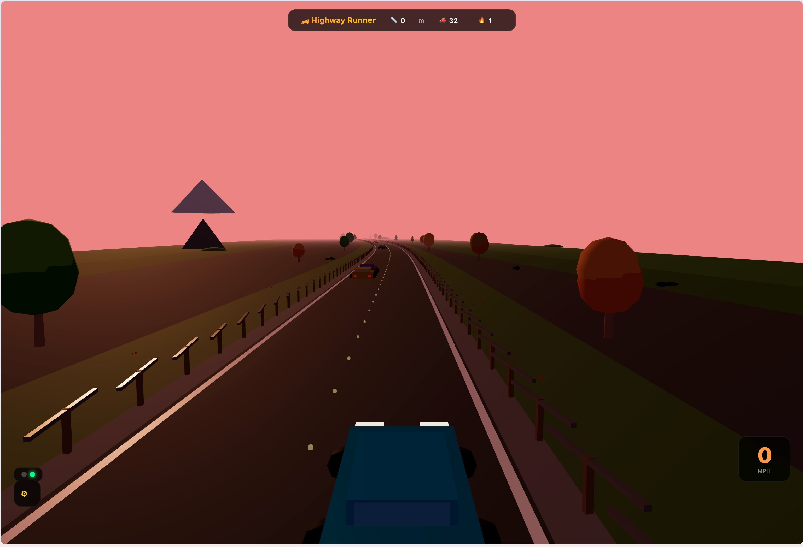

# 🏎️ Highway Runner

A browser-based 3D driving game built with **Three.js**. Race along a bending mountain highway, navigate adaptive AI traffic, and survive as the day fades into night.



## 🎮 How to Play

| Key                       | Action                            |
| ------------------------- | --------------------------------- |
| **W** / **↑**             | Accelerate                        |
| **S** / **↓** / **Space** | Brake                             |
| **A** / **←**             | Move left lane                    |
| **D** / **→**             | Move right lane                   |
| **V**                     | Toggle view (FPV / Top-Down)      |
| **R**                     | Reverse direction                 |
| **N**                     | Skip ahead in the day/night cycle |

- **Score**: Distance traveled in meters — displayed at the top.
- **Speed**: MPH gauge in the bottom-right corner.
- **Difficulty**: The 🔥 indicator shows the current difficulty level (1–10). Traffic density, AI speed, and spawn rate increase over time.
- **Overspeed**: Exceeding 70 MPH shows a warning, but your score remains distance-based.
- **Crashes**: Hitting traffic ahead ends the game. AI cars that rear-end you are safely absorbed.

### Mobile

Tap zones on the screen — no keyboard needed (first-time players see an onboarding guide):

| Zone                            | Action                |
| ------------------------------- | --------------------- |
| Left half (tap left/right side) | Lane change ◀ / ▶     |
| Upper-right (hold)              | Accelerate            |
| Lower-right (hold)              | Brake                 |
| Double-tap center               | Toggle controls panel |
| Long press (1.2s on game over)  | Restart               |

Orientation: landscape recommended for the best field of view.

## 🚗 Features

- **Curved scenic highway** — trees, mountains, wildflowers, guardrails, and rolling hills
- **AI traffic** — cars speed up, slow down, change lanes, and create braking shockwaves
- **Dynamic difficulty** — traffic intensity ramps smoothly over 3 minutes across 10 visible levels
- **Adaptive lighting** — headlights and brake lights brighten naturally after sunset
- **Two camera modes**: Third-person FPV chase cam & top-down orbital view
- **Looping day/night cycle** — the world starts at a random time of day and transitions continuously
- **Mobile-ready controls** — touch zones and first-run onboarding for phones
- **Procedural audio** — engine growl, brake hiss, crash impact, and horn sounds via Web Audio API

## 🛠️ Tech Stack

- [Three.js](https://threejs.org/) — 3D rendering
- Vanilla JavaScript (ES Modules) — game logic, AI, difficulty, and rendering setup
- No build tools required — runs directly in the browser

## 🚀 Getting Started

Simply open `index.html` in any modern browser. No server or build step required.

```bash
open index.html
```

Or serve locally:

```bash
python3 -m http.server 8080
# then open http://localhost:8080
```

## 📄 License

[MIT](LICENSE)
